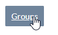
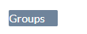
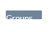
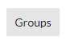
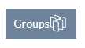
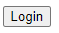
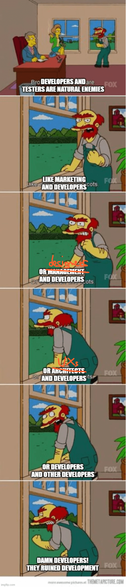
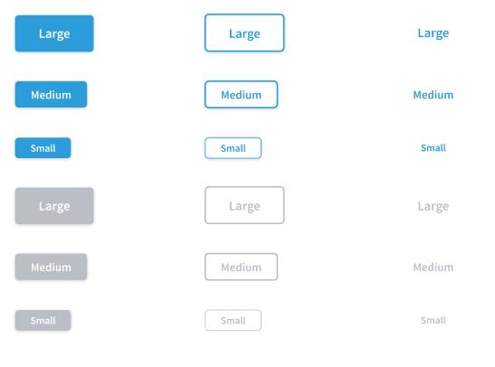

 
## A frontend team without a design system

We develop frontend systems every day. We know it well: if you have to remember how to style a button, you will miss something: padding, margin, colors, background, font... **you cannot remember all the CSS rules**, I know.

And I assure you: many companies work this way. You have to play “treasure hunt” and look for the CSS rules of the button hidden somewhere in the code.

We are talking about the old “copy/paste”, and it is scary even to write about it.

## The button monsters list

Do you know what happens with _word of mouth_? At each step, a few pieces are lost or a few sentences are misreported.

Without a design system, we have the same problem: each time you miss something new **design monsters emerge**:

- **the link button monster**, where there was a metamorphosis between the button and the link

- **The “slimer” button monster**, where padding got lost somewhere

- **the "guess riddle" button monster** (no need to rage further)

- **the serious button monster**, except for the missing typography… but which dev cares about typography?

- **the Cupid button monster**, in which the text and the icon want to stick together forever

- **the Neanderthal button monster**, the basic one, when you give up (which is not even the ugliest, except that it is at the mercy of the browser)

And we’re frontend devs, we know that something is wrong. But it is not the focus of the feature we are implementing, so it’s not important right now. **Which means that it’s not important ever.**

A simple CSS class would be enough to establish the style of the button once and for all.

And we are talking about buttons; I know many of you will say: _"but I already manage buttons with a class"_.
Good! great job.
But do you do it for everything related to the frontend?
Because if sometimes, somewhere, you have doubts about which margin/padding/font size to use, then there is still a problem.

CSS classes are the first step. Then you need to structure the project in a better way.

And today, finally, there is a method that allows you to solve everything with elegance: **the design system**.

## Why you are wasting time without a design system and the “rosetta stone” of the frontend teams
When developing a software product, there are two important goals:
- **maximizing efficiency**: trying to get there without wasting time
- **minimizing bugs**: minimizing the possibility of errors

Many teams are involved in the process: **the dev team**, **the design team**, **the UX team**, and so on.

Devs and designers speak a different language, devs and UXs speak a different language.

The design system is like a _“rosetta stone”_: a very powerful tool shared between designers and developers.

They both love it as it simplifies and speeds up the work on both sides.

With a well-done design system, we will be able to cover points 1 and 2 mentioned above and much more.

## How the design and developer teams can benefit from a a design system?

A design system is a tool that has two faces:
- on the designer side, it is a set of mockup components, which the designer has produced and which he uses and reuses to create more complex designs
- for developers, it is a set of developed components, ready to use in their projects

There is a one-to-one correspondence between the design components and the developed components.

### Let's understand it better with an example: buttons
Speaking of buttons, on the design side I could have the button in 3 sizes (small, medium, large) and 2 variants (filled, outline). The main color, the color of the text, the borders, the shadows are all defined.

On the developer side, I will have the same button component. Size variants will always be 3 and often specified with 3 CSS classes. The color, corners, or shading will be defined once and for all in the component.

Since the rules of the button are now fixed on the designer and developer side, two interesting things happen:
- when a button is needed, the designer does not have to draw a rectangle and specify the colors every time: he has it available in the design system library ([Figma](https://www.figma.com/) has a specific function for the components of the design system and it is easy to [define your design system into a library](https://uxdesign.cc/simple-reusable-design-system-in-figma-a3a01236a7e3))
- the developer will reuse the component of the developed design system, without the possibility of leaving out “unimportant nuances” while developing a feature in which the button is secondary. In particular, the colors, the shadows, the roundings, etc. have already been defined and will be reused.

Designers and developers cannot make a mistake implementing the button: what to do and how to do it are set in stone by the design system. Since everything has already been said on the button, you shouldn't waste time discussing it or thinking about it.

On the developer side, there is also no possibility to create graphic bugs. And when we deal with more sophisticated components, even functional bugs will disappear because the design system is solid and stable.

**The design system is the foundation of our projects.**

We maximized effectiveness since we focused on the feature only, not the components. And we minimized bugs since we do not have to rewrite these components again.

## The 5 characteristics of a well-done design system
We (The Frontend Team) focused on these goals when designing the design system:
- Easy to **reuse**
- Easy to **integrate** into all frontend frameworks
- Easy to **extend**
- With a high **developer experience** in place
- Easy to **test**

With these goals in mind the frontend team made a choice: use **Tailwind** and **Scss** to develop **a pure CSS framework-agnostic design system**.

## Why a pure CSS framework-agnostic design system 
We tried to build a design system for a specific framework, in Angular.

Then we needed to have a Svelte version. 

So we thought it should be multi-framework, should we re-implement it?

What if we develop our design system using a multi-purpose framework? like Stencil or mitosis?

We opted for Stencil, which in theory exports web components for all frameworks. 

In theory. Because the result is a poor developer experience for any framework.

I wrote more about this here: [Pure CSS design system in tailwind VS web components, angular, react, vue, svelte](https://www.butopen.com/blog/why-a-pure-css-tailwind-design-system/).

So finally we decided to build a pure CSS design system.

## What are the components of a design system?

Here is a list (far from being complete) of components that should be part of a design system.

In the next posts we will discuss how to implement each of them.

### Theme
- Colors
- Text size and typography
- Spaces

### Atomic components
- Card
- Mini-card
- Badges
- Icon badges
- Buttons
- Icon
- Divider

### Boxes
- warning
- success
- error

### Form components
- Field labels (vertical and horizontal)
- Input (text, numbers, dates)
- Input from / to
- Input time
- Select
- Textarea
- Checkbox
- Switch
- Radio
- Multi-tag
- Error / validation messages
- File upload

### Tables
- Basic table styles
- Pagination

### Components with logic
- Tabs
- Autocomplete
- Modal
- Popup with a Tooltip
- Header (Desktop and mobile)
- Horizontal container
- Section expand / collapse

### Singleton components
- Notification
- Loading (full-screen and inline)
- Global errors

We will see how to develop each component and keep the design system super-easy to consume, integrate, debug and customize.

Finally, our mission is to make the world a better place… for frontend teams. So our design system is open source and available on GitHub: [https://github.com/butopen/butopen-design-system](https://github.com/butopen/butopen-design-system)

Stay tuned.
