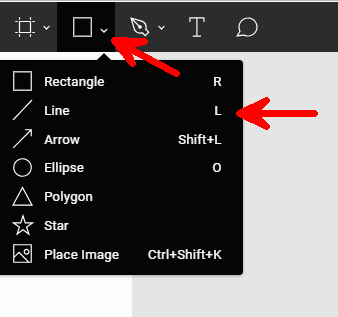
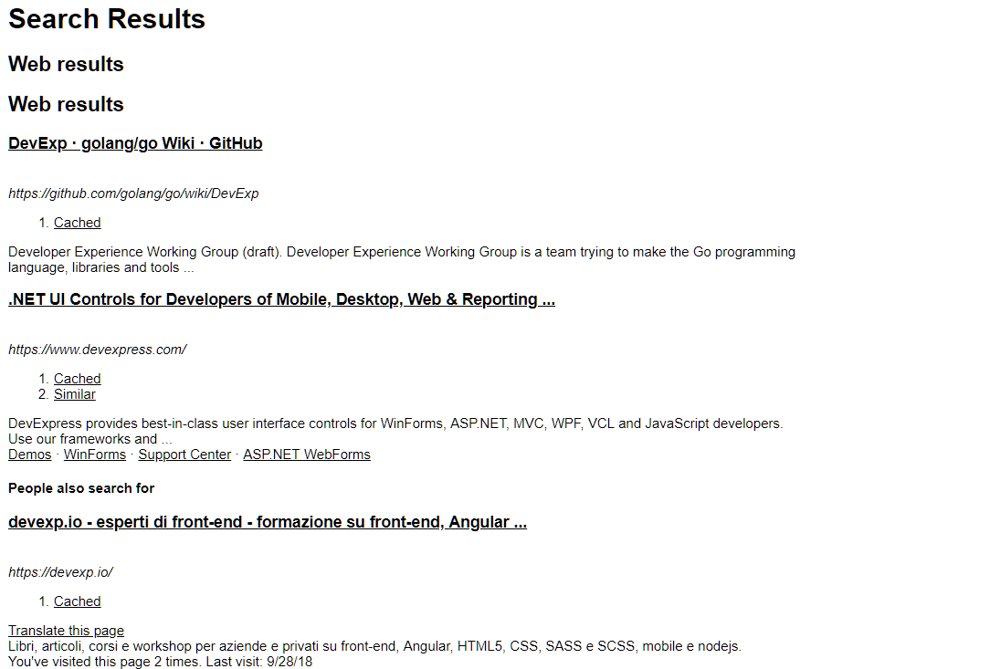
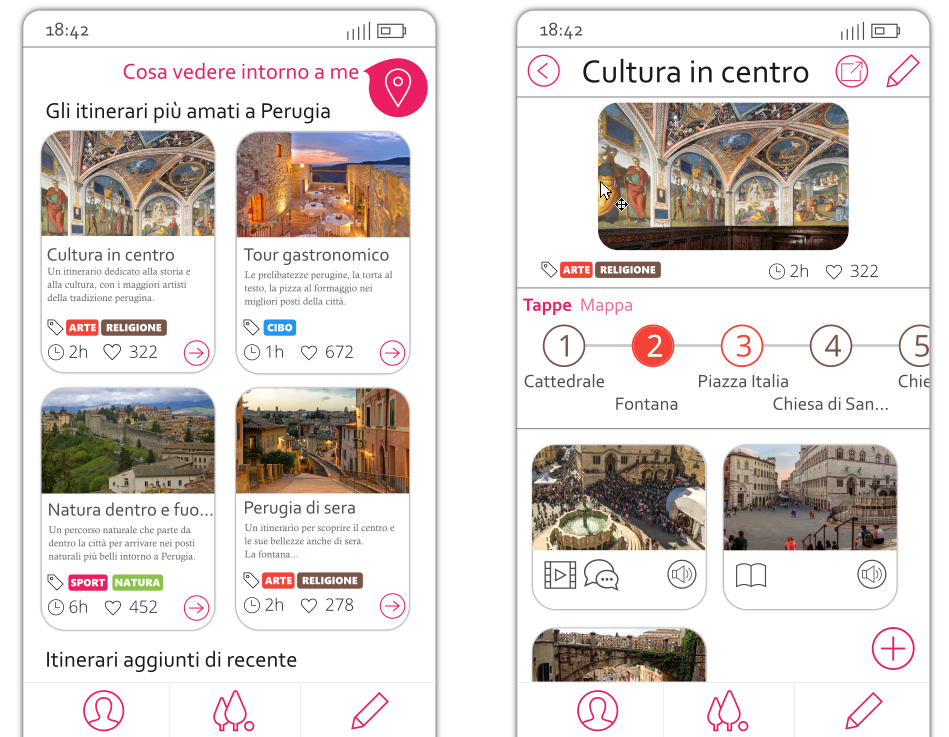

This book is part of the *Definitive Frontend Guides* series at
*[thefrontendteam.com/books](https://thefrontendteam.com/books)*

## Table of Contents

[Chapter 1: Basic Guide to Creating a Mockup and a Prototype of a Web
Application Within a Few Hours](#chapter-1-basic-guide-to-creating-a-mockup-and-a-prototype-of-a-web-application-within-a-few-hours)

- Step 1: Inspiration

- Step 2: Creating a Sketch

- Step 3: The Mockup

- Step 4: Techniques Used to Create a Mockup

[Chapter 2: The Most Important Web Design Techniques for a Frontend
Developer](#chapter-2-the-most-important-web-design-techniques-for-a-frontend-developer)

- Contrast

- Repetition

- Alignment

- Proximity

- Fonts and Design

- Colors: Palettes, Combinations and Some Developer Tools

- Icons: Styles, Creation Bases and the Best Sites to Find Uniform Icons

[Chapter 3: User Experience for Frontend Developers](#chapter-3-user-experience-for-frontend-developers)

- Step 1: Give Value With the UX

- Step 2: Iteratively Create Simplicity, Speed, and Completeness

- Step 3: Fun and Aesthetics

- Step 4: Iterative UX Process

- Verifying the UX of the Created Product

- Evaluating the UX of a Web Project: User Session, Videos, and Heatmaps

[Chapter 4: How to create the mockup of a landing page step-by-step](#chapter-4-how-to-create-the-mockup-of-a-landing-page-step-by-step)

- How to design the texts for an effective landing page: Information UX
for an LP

- Build a Landing Page in Figma: How to Create a Mockup

[Conclusions and What's Next](#conclusions-and-whats-next)

## Before we start

We developers are people who always strive to understand problems and
try to solve them together with our team.

In my experience as a frontend developer, I\'ve noticed that frontend
developers often don't know the language of designers and user
experience (UX) experts, which makes it difficult to communicate. As a
result, there are often misunderstandings, and projects do not develop
as expected.

There is also a false tendency to think that designers/UXs and
developers live in different worlds.

However, I can assure you that a developer can easily learn the basic
concepts, which are simple to learn and easy to apply.

Once learned, these concepts will allow us to better understand some
design and UX choices, with the result that each project will be
perfectly balanced in terms of design, UX and development.

I wrote this book because I want increasing numbers of developers to
enter the world of design and UX, and to know just the basics (not to
replace designers, God forbid---to each his or her own work).

The aim, in fact, is quite the contrary: it is to **make the
collaboration between frontend teams more effective and efficient**, so
that the end user can achieve the maximum benefit from the final
product.

In this book, you will learn:

1)  How to easily create a mockup in Figma that is graphically similar
    to the final app;

2)  How to create a mockup that is beautiful to look at, easy to use,
    and well crafted;

3)  What needs to be done to give a better UX to the end user of a
    product.

About me, the author, I have worked in frontend development for several
years now. I have already written two books (one about Angular, and one
about Design Patterns in TypeScript), and there's always more to learn.

If you:

-   want to know more about me,

-   have any questions/feedback about the book,

-   or just want to talk about frontend development,

then get in touch on LinkedIn at
[**linkedin.com/in/salvatoreromeo**](https://linkedin.com/in/salvatoreromeo).

Now let's start to enjoy learning the design/UX concepts that will
change you as a frontend developer forever.

A small note: you can find **updates about this book** in a dedicated
page at <https://thefrontendteam.com>

If you have any feedback about the book, then contact me directly at
<romeo@thefrontendteam.com>.

## Chapter 1: Basic Guide to Creating a Mockup and a Prototype of a Web Application Within a Few Hours 

When we need to create a new front-end project, the worst thing we can
do is to develop the code right away. There are three mistakes that are
very common:

1.  The project does not correspond to what the customer wanted;

2.  The project is not usable;

3.  The project is not aesthetically beautiful.

To overcome all of these problems, it is useful to create a mockup
consisting of the graphics of the app, which can be shown to the various
interested parties before even a line of code is written.

Even if you are not a designer, creating a mockup is something everyone
can do, including frontend developers.

##### Introduction

In this chapter, we will introduce the techniques and practical tools
needed to create a mockup, while in the following chapters, we will
understand how to create an excellent application in terms of the user
experience and design.

### Mockup: How to Create One Within a Few Hours and Make It Interactive

How much time and which tools and techniques are needed to create a new
web project?

The image above shows a web app, or rather something that will be a web
application. In fact, not a single line of code has yet been written.

The first step towards generating clear ideas about a product and
creating excellence in terms of quality is to move the product out of
one's mind into the form of actual images.

In this way, we can actually share what is still only in our head.

Images showing how the web or mobile application will look are called
**mockups**. These have many advantages, for example:

-   They are quick to create;

-   They are very similar to the graphics of the final product;

-   They allow the design and development team to fully understand
    **what needs to be done**;

-   Since they can be rendered in an interactive form, when we show them
    to the end user, we can **gather UX and design feedback within a
    very short time**.

In my opinion, the feedback received from the user at this stage is of
the highest possible value: based on this feedback, we can create a new
version of the mockup that better meets the needs of the end user,
without high times and costs, compared to actual development.

Although asking a designer to create a mockup is the obvious choice,
this is often not possible. I think it is important even for
non-designers to have a basic knowledge of how to create a mockup.

For frontend developers, how complicated is the process of making a
mockup?

In this first chapter, we will introduce the techniques and tools used
to create a mockup, while in the next sections, we will explore how to
develop a mockup by maximizing the design and UX.

#### Step 1: Inspiration

Even experienced designers need to be inspired to create their designs.
For developers, taking inspiration from external work of other designers
can help a great deal.

To examine mockups for existing projects, I recommend searching the
following websites.

##### Dribbble

Although Dribbble is a generic website for designers, searching with
queries such as \"mobile app\", \"mobile mockup\", \"web\" or
\"dashboard\" returns an enormous number of very elegant designs.

For example, look at
[https://dribbble.com/search?q=Mobile+app](https://dribbble.com/search?q=Mobile+app).

##### ThemeForest

ThemeForest is dedicated exclusively to selling templates. Some
templates are really well done, and can be useful in terms of inspiring
the creation of a new project, for example
[https://themeforest.net/](https://themeforest.net/).

#### Step 2: Creating a Sketch

Before creating a detailed mockup, we need to have a clear idea of what
we want to achieve.

Even though creating a mockup is a quick operation, creating a sketch of
an application with pen and paper is even faster.

At this stage, I recommend a simple trick: don't to be precise, but try
to create an initial version that shows the most useful features for the
end user.

After correcting the first draft a few times, we can move on to the
mockup.

Tip: It's more effective to iterate these drafts with the help of
another person.

#### Step 3: The Mockup

At this point, we are ready to create the mockup. In this step, we will
summarize the techniques that can be used to make a mockup, and in the
following step, we will introduce some software tools for generating a
mockup quickly and effectively.

Which techniques are needed to create a mockup?

We can create mockups at various levels of detail. If we want to be
pixel perfect, then we can use **vector graphics software** such as
Figma (web), Sketch (Mac only) or Inkscape (free, portable and
multiplatform).

To create a mockup with standard components, we can use software with
**ready-made component** libraries based on drag and drop, which allow
for the creation of pages with buttons and images in a very short time
(e.g. Mockups or Figma).

Personally, I prefer the vector graphic software: after a little
practice, the developer can achieve anything that can be imagined.

Moreover, there are now numerous ready-made component libraries called
design systems for software such as Figma, which let you still use drag
and drop to quickly create GUIs and so have the best of both worlds: a
vector graphic software with ready-made components.

At
[https://thefrontendteam.com](https://thefrontendteam.com),
we have several articles describing what a design system is and how to
create one on your own.

Since Figma is useful in both cases and is free, we will use this tool
in the examples below.

Note that in the following section, **we explain the techniques
involved, rather than just how to use Figma**. You can use these
techniques with any software.

##### Getting Started with Figma

Before we begin, let\'s get acquainted with Figma.

-   Go to the site
    [https://www.figma.com](https://www.figma.com/), and
    sign up;

-   Immediately after signup, you will see a screen similar to the one
    below:

-   After confirming your email, you will see some example projects,
    such as those illustrated below.

-   

To become familiar with this tool, open some of the listed files and
start to experiment.

We will learn the basics in the following section.

#### Step 4: Techniques Used to Create a Mockup

To create a mockup, regardless of the software that will be used, we
need to learn some simple techniques, such as:

-   **Navigation**, i.e., how to move around the canvas;

-   **Rectangles and rounding**, which are used to create the shapes and
    structures that will form the components of the application;

-   Straight **lines**, which will be used as separators and enclosures
    to create more complex shapes;

-   **Images and icons**, which can be used to characterize our
    application;

-   **Groups**, which will allow you to move and resize sets of simple
    shapes as if they were a single object;

-   **Alignment**, which is used to create a clean, elegant design;

-   **Interactivity**, which allows the user to evaluate their
    experience of the application as if it were the real thing; this is
    especially useful in the presence of customers/end users.

We will review these tools for the general case, and will illustrate how
to use them with Figma software in particular.

##### Navigation

The first thing that you need to learn is how to navigate around the
canvas. The canvas is infinite, so you can add lots of pages. You can
move left/right or up/down, and zoom in and out.

To navigate around a project, use the mouse wheel:

-   Use scrolling to move the *canvas* **vertically** in the same way as
    a web page;

-   Press *SHIFT* to scroll **horizontally**;

-   Press *CTRL* to control the **zoom**, which is useful for moving
    quickly to distant parts of the *canvas*.

Try these and experiment a bit. These are the functions you will use
most often in everyday work.

##### Rectangles and Rounding

When creating a mockup, you will need to create a graphic structure. The
most common objects used in a mockup are rectangles. We will use these
both directly as pieces of the application and also as graphic
components to create more complex objects.

When creating a mobile application, I always like to have a reference,
so I always make a skeleton of a mobile phone as follows:

-   Select the *rectangle* tool in the top left corner:

-   Add some rounded edges using the circle in the top right corner of
    the rectangle you have just drawn.

-   Let\'s change the background to white and add a shadow using the bar
    on the right, as shown below:

Rectangles and rounded rectangles form the basis for the graphic
structures used in any desktop or mobile application.

As a final note, we can change the rounding of each corner separately
using the properties shown in the button on the right:

##### Lines

Another requirement when creating mockups is to separate the different
parts of the application. In some cases, using space is adequate, but
sometimes you need lines.

To create a line, click and hold down the rectangle button to open the
menu:

As an example, we will draw a line to highlight the status bar of the
phone:

In any vector graphics tool, you can force a horizontal direction of the
line. In Figma, you will get a straight line by holding down the *SHIFT*
key while drawing the line.

We can change the curvature of the line or add points to break the line
using the tools in the top left corner (which become visible when you
click on the line):

Most of the time, you will only need to use vertical and horizontal
lines, but it is also useful to know that Bezel curves exist.

##### Importing Images and Icons

The aim of the mockup is to resemble the final app. The more realistic
it appears, the better the feedback you will get from stakeholders.

Images and icons can bring to life a mockup that otherwise would seem
artificial. In Figma, we can use copy/paste from any application and
find the copied image by pressing *CTRL + V* directly in the browser.
Figma also supports SVG icons*.*

On the website
[http://iconmonstr.com](http://iconmonstr.com/), you will
find many icons in SVG format. You just need to copy the code to make
them available as a vector on the Figma app.

For example, we can complete the image of the mobile phone by including
icons for the battery, WiFi and clock:

-   Search for "battery" and click on any icon of a battery. Then click
    at the bottom on \"I agree \...\" and "Embed";

-   Select all the SVG code and paste it directly into Figma to see the
    icon, as shown below:

-   We can proceed in the same way for the other icons, and obtain the
    complete bar as shown below:

SVG icons are very powerful because you can scale them without losing
detail. Moreover, you can change the color of an icon directly from the
app. Sometimes you will need to slightly modify an icon, and SVG allows
for easy modification of the shape: double-click the icon and play
around with the icon shape (also called **path**) by dragging the
borders.

What about images?

You can also paste images. These can be copied from any web page, and
pasted into Figma. But you should check the copyright. One good place to
find images is [unsplash.com](https://unsplash.com/).

When pasting an image, you usually want to use only part of it. To
achieve this, we can take advantage of **masks**, which are objects that
can be placed under an image to hide everything except the part the
image that is over the object. Figma chooses to mask with the object
UNDER the image, while other apps offer masking by using objects OVER
the image. Personally, I prefer the latter :-)

The steps needed to create a mask are as follows:

1)  Create a rectangle (or any other shape) over an image;

2)  Right click on the image and select "Bring to top";

3)  Now select both the image and the rectangle (by using the SHIFT key
    or by selecting them from the list in the left menu);

4)  Right click and select "Use as mask".

The image above shows the result (when you deselect, only the masked
image will be visible, without the borders). To edit the mask, double
click on the masked image.

##### Groups

In a mockup, some parts of the application are often similar to others.
You don't need to re-draw each part every time; instead, you can create
*graphic components* and reuse them as needed. In Figma, the concept of
components is built into the app, but all mockup software (including
Figma) offers the more general concept of **groups**.

Groups can be thought of as containers for graphic components (or
graphic *objects*). You can also create groups of groups ( :-o ).

To create new groups, select multiple objects, and then *right click \>
Group Selection*.

A group can be moved and resized as a whole. The result is that the
elements within the group are scaled and moved proportionally. To resize
a group, just press the *k* key and then drag the small squares
positioned around the group.

A group is also useful because we can duplicate it with *CTRL + D* to
obtain a new, identical object that is ready to edit.

In the final mockup of the application shown at the beginning of this
chapter, I duplicated the card several times and then modified only the
image and the text inside, as shown below.

To create the mockup above, I used only the techniques introduced so far
in this chapter: rectangles, images, icons and groups.

As a final note, you can select a group or an object within it by double
clicking. Alternatively, you can use the menu on the left side, which
makes visualization of the group structure easier, as shown below.

##### Alignment

A mockup is pleasing if it has some degree of order and a clean
appearance.

When creating a mockup, it is good practice to respect some basic design
rules. We will see in the next chapter what these rules are for a
front-end developer, but in the meantime, we can see that **alignment**
plays a fundamental role.

The application itself always offers *guides* that can be used to
**align objects with respect to other objects** or the center of the
canvas. If you look at the sidebar, you will see that there are also
some buttons for aligning groups of objects at the top, bottom or center
and for distributing them horizontally or vertically, as shown below.

We'll see later how much difference there is between a non-aligned
mockup and an aligned one. For now, we will simply note that alignment
can be easily achieved as illustrated above.

##### Exporting

The time has come to export our project. To do this, we first create a
group, and in the right sidebar, click on the ***+*** symbol next to
*Export*:

We can then choose which format to export to (PNG, SVG, etc.).

Another way to export part of the graphic is to use the left sidebar:
you can right-click on any element and choose *Copy as SVG*, *Copy as
PNG*, and so on. You can then paste it into your application as shown
below.

##### Interactivity

After having created several pages for our application, it would be nice
to give life to our project by allowing the user to click on one page to
go to the next, almost as if the application was real.

In Figma, there is a particular type of group called a *frame*, which
can be used to make an application interactive.

To add a *frame,* click on *Frame* at the top left, as shown below:

From the properties on the right, we can change the dimensions of the
*frame* to match those of a real device.

Below, you can see the result for a frame for an iPhone 8:

We can add to the frame all the objects that represent one page of our
application.

In the following, we illustrate how to create two frames.

From the right bar, we can choose the *Prototype* tab to add an action:
when the user clicks on a *frame,* the next one is displayed. This is
illustrated in the image below.

To try our live mockup, we can press the *Play* button in the top right
corner:

### Well done!

In this chapter, we have seen what a mockup is and how it can help us
visualize a new application even before it is developed.

We have also learned that only a few techniques are needed to create
mockups, and these are easy to learn and apply (creating rectangles,
pasting images and icons,...). Figma is an online app that can be used
to create mockups using these techniques.

As discussed in the introduction, knowing how to create a mockup is just
the first step: the aim is not just to create a mockup, but one that is
*beautiful* and *usable*.

In the next chapter, we will explore the basics of UX and design that a
developer must know in order to create an aesthetically pleasing and
above all very usable mockup.

## Chapter 2: The Most Important Web Design Techniques for a Frontend Developer

How complicated can designing a web project be? How do you design a
mobile application? Are there any design techniques that even a frontend
developer can learn and apply? And how complicated are these techniques?

Developers often have no design skills, perhaps because they believe
that these are inborn and cannot be learned.

In fact, the basic rules are simple, can be easily learned and can
always be applied to a sketch or a mockup.

In this chapter, we will introduce the CRAP techniques (contrast,
repetition, alignment, proximity) and give some hints on fonts, colors
and icons. More importantly, we will contextualize these techniques to
frontend development.

### Introduction

In the previous chapter, we learned how to create a mockup with software
tools. However, it is also necessary to know how to use these tools in
the best possible way, especially from an aesthetic point of view.

In this chapter, you will learn how to make a web project elegant and
aesthetically beautiful.

The basics that we will introduce here actually apply to every graphics
project; however, we will discuss them from the point of view of
frontend developers, who often tend to create designs that are too bold.

### CRAP (Contrast, Repetition, Alignment and Proximity) + Mockup Tools for Applying These Techniques

When I first read *The Non-Designer's Design Book* by Robin Williams, I
was fascinated ([[https://www.amazon .ca / Non-Designers-Design-Book-4th
/ dp /
0133966151]{.underline}](https://www.amazon.ca/Non-Designers-Design-Book-4th/dp/0133966151)).

Ever since that moment, every time I have designed a graphical
interface, I have tried to respect the basic principles described in
that text. There are a few techniques that allow anyone (even
developers, who often do not have a graphic design soul :-) ) to respect
simple rules that can make a project harmonious, without running into
visual disaster.

The four principles we are going to introduce are:

-   Contrast

-   Repetition

-   Alignment

-   Proximity

You will notice that the first letters of each principle form the word
CRAP, which is exactly the opposite of what we want to achieve.

It is precisely the **contrast** between the meaning of the word CRAP
and what we can achieve by respecting these principles that will ensure
that we will never forget these four techniques.

So, let\'s have a look at them and understand how to apply them using
the most common design tools.

#### Contrast

##### Why

Using this technique, we can **direct the user\'s attention** towards
specific elements. Contrast allows us to create graphic structures and
to give greater or lesser importance to the various parts of our design.

We can take the mockup above as an example. In this case, I wanted to
make it clear to the user that he or she could interact with some parts
of the interface, so all the elements in pink are clickable.

Furthermore, there is one clickable element that is more visible than
the others: the pink marker button in the top right corner. In addition
to being larger, this button has also a shadow to make it stand out.

##### Understanding the Use of Contrast with an Example

Imagine a web page without images, where the title, paragraphs, menus
and other text are all in the same font, with the same size and in the
same black color on a plain white background.

Do you recognize the page above? It's a Google search.

It's difficult to orient yourself without a minimum of number of
graphics, isn't it? The first principle that allows us to improve a
design is *contrast*.

By creating contrast between the various elements, we make structures
easy to identify, for example:

-   Titles (in blue)

-   Links (in green)

-   Descriptions (in black)

##### Color

Color is the first tool we can use to create contrast.

Different shades of color can be used to orient the user towards certain
elements rather than others: for example, we could use three shades of
gray for three different text elements, giving the darkest color to the
most important types of text.

##### Size

Another important aspect of creating contrast is the size of text and
graphics.

In the example of a Google search above, to make the user place more
**importance** on the title than the URL or the description, the size of
the title is larger.

In general, a larger size allows you to place greater importance on an
element.

##### Fonts

Font is a contrast tool that has a lot of potential.

We have already mentioned that the font size can be useful for creating
contrast. When we use a font, we can also create contrast by changing
other characteristics of the font, such as:

-   The font family (as we will see later)

-   The style (bold, italic, etc.)

There is much to say about fonts, and a later section is dedicated to
this topic.

However, as specified below, using the right fonts also means
understanding which emotions you want to convey. The purpose also needs
to be considered (for example, do you want the user to read, to
understand, or to pay attention?) and for this, I would rely on an
expert designer to make the right choice, although you will find some
hints later on.

##### Use of Graphics to Highlight Elements

The last technique we are going to introduce in this section concerns
graphic elements that are used to highlight something.

The most common element is **shadow,** and for non-experts, I would
recommend using very light, centered shadows with respect to the object.

Almost all mockup software has specific shading tools (in Figma, you can
add a shadow using the menu on the right side).

In vector graphics software, we can create a shadow with very fine
control by starting with a duplicate of particular shape and changing
its transparency, black gradation and blur. We can then place it under
the graphic element to create a shadow.

Below is an example using Inkscape (free on Windows, Mac and Linux).

A shadow element can also be used to highlight an object more
explicitly: by leaving the blur at zero and/or using a color other than
black, we can create different highlighting effects.

That's all for contrast. Let's now look at repetition.

#### Repetition

##### Why

When we create a new web application, we cannot afford to use a style
without rules. If we do not have a set of rules, sooner or later a page
in our system will be graphically different from the others.

When semantically related elements have different graphic styles, there
is a sense of clutter and noise that causes the user to lose focus.

Repetition allows us to be graphically consistent and to create a sense
of relaxation for the user.

To avoid creating pages with inconsistent graphic structures, a web
developer has two tools:

-   The theme of the application;

-   The components (web components).

Both of these tools will allow us to apply the CRAP technique known as
repetition.

##### Understanding Repetition Using an Example

Repetition is perhaps the technique that is most similar to what
developers try to achieve every day. In short, it means being consistent
with the graphics. From the previous example of a Google search, we can
immediately recognize the graphic style and structure of the results.

Today, this same graphic theme is used by almost all search engines,
with slight variations.

Repeating a graphic structure with the same colors and the same
dimensions allows us to:

-   Create order;

-   Orient the user, as he or she can recognize semantically common
    elements with the same graphic style.

In web development, repetition is the foundation of the frontend theme.

##### Repeating Colors and Dimensions: The Theme

In order to use the repetition of graphic styles for semantically
related elements in a disciplined way, we need to create a **theme**.

The theme defines some basic rules, such as:

-   The main color

-   The secondary color

-   The tertiary color

-   The main dimension (for font, margins, spacing, etc.)

-   The secondary dimension (for font, margins, spacing, etc.)

-   The tertiary dimension (for font, margins, spacing, etc.)

-   Fonts

-   Groups of style rules to be applied in bulk (CSS classes).

For non-graphics experts, it is recommended to limit the number of
colors to two and to use no more than three shades of these colors (to
give more or less importance). In addition to these two colors, we could
use at most five shades of gray and white (*50 Shades of Gray* does not
apply to frontend design ;-) ).

I suggest defining three dimensions for the text: small, medium and
large. For each textual element, one of these three dimensions is used,
based on the importance of the text.

As frontend developers, we can ensure consistency with a theme by
starting with a CSS framework such as bootstrap
([https://getbootstrap.com/](https://getbootstrap.com/))
or minicss
([https://minicss.org/docs](https://minicss.org/docs)) and
customizing the theme with our colors and dimensions.

More recently I felt in love with TailwindCSS
([https://tailwindcss.com/](https://tailwindcss.com/)). It
enables us to use fixed-size classes for colors, sizes, shadows,
backgrounds and so on. Using a CSS framework like Tailwind makes a web
project more robust to graphical errors, since the choices are limited.

At
[https://thefrontendteam.com](https://thefrontendteam.com),
we are building a complete design system using TailwindCSS. You can
check the site for useful posts and I promise I will talk about design
systems in another book :-)

A design system is an advanced concept that can greatly help with
repetition. The blocks that form a design system are known as
components. We will discuss what a component is in the next section.

##### Components

When applying the technique of repetition, we need to consider the
organization of graphic elements into **components**.

In the previous example of a Google search, each individual search
result can be seen as a component consisting of three parts:

-   A title

-   A URL

-   A description

This set of three elements with their colors and fonts is called a
*snippet*. The *snippet* is used multiple times within the page, and
allows the user to identify the **structure** representing a search
result quickly, on the same page or on different pages.

Graphic components can be used to repeat the same structure wherever the
same behavior is needed.

The mockup above shows an app that allows the user to browse tourist
itineraries.

I have defined a graphics *card* that I use (by *repeating* it) each
time I need to show a *tourist route*.

It is important that the *tourist route* is stylized with this graphic
structure wherever it is shown; otherwise, the design will be
inconsistent and the results will be misinterpreted by the user.

##### Creating Components in the Mockup

When we identify a semantic structure that will be repeated many times,
we can use the grouping tool provided by the mockup software.

In general, this tool can be activated as follows:

1.  Select a group of elements;

2.  Right click;

3.  Select *Group.*

Steps 2 and 3 can often be speeded up with the combination *CTRL + G
(CMD + G* on *MAC*).

When I have identified and created a group, I can reuse this structure
using the *Duplicate* tool (commonly CTRL + D) to clone the newly
created group, and can then modify some internal textual or image
elements to create a different copy that will still be graphically
consistent.

The mockup cards in the previous image were created with this technique.

##### Component Development

At the development level, we can apply repetition using *web
components*. The HTML language contains native tags such as bold (\<b\>)
and paragraph (\<p\>). Web components are custom tags created by a
developer, and can be used in our web projects simply by integrating
some JavaScript files.

Modern development frameworks all use this concept, and allow you to
create web components. *Angular, Svelte, React,* and *Vue* are perhaps
the best of the current frameworks for developing a component system.
Again, you can check thefrontendteam.com to find out more about web
components and learn how to develop a frontend system based on
components.

#### Alignment

##### Why

If you experience aesthetic uneasiness when looking at a website but
cannot explain why, there is a good chance that it is an alignment
problem.

A designer\'s eye is well trained in this regard, and can spot
misalignments in an instant. However, developers sometimes overlook
proper alignment---I think this is because we tend to focus on the
logical functions, and do not pay attention to the aesthetic side.

It is therefore a good idea to spend a few seconds at the end of an
implementation to check that we have respected all the alignments.

Alignment creates comfort and allows the user to easily organize the
content and distinguish the graphics structures.

At the design level, we can (and indeed must) pay close attention to
alignment when designing our interfaces. At the development level, there
are several tools that can come to our aid, as we will see shortly.

##### Understanding Alignment Using an Example

If we open the usual page of Google search results, we can see that the
positions of the results respect lines to the left and to the right.

Take a look at this mockup:

It looks pretty neat. But was it all aligned by hand? Obviously not.

When designing a mockup, we can use guidelines to define the alignment
of objects.

At the level of each group, a few lines may be sufficient to create
order in the design:

-   At a higher level, we define page lines;

-   At a lower level, we focus on the lines for the specific component.

In a similar way to the repetition technique, it can be useful to define
three or four reference dimensions for margins and spaces.

##### Alignment for the Web Developer

For web developers, respecting the alignment of the elements means
having well-defined rules (read CSS rules ;-) ) regarding *margins* and
*padding*. The *padding* defines the space between the edge and the
internal content of an element, while the *margin* defines the space
between the edge and the exterior of an element.

In Chrome, the developer tools include the *style* tab*,* which provides
us with information on the *margin* and *padding* of a specific element,
as shown below:

If we use a CSS framework in our projects, it is often the framework
itself that provides us with *CSS classes* to respect the alignment of
the elements that make up our page.

##### Bootstrap/Tailwind and Alignment

In Bootstrap and in TailwindCSS, we can manage alignment using specific
classes for the margins and padding. Each class has a name that is
constructed to define an alignment with a specific dimension. The logic
of class names is very simple. To understand it, let\'s see some
examples of classes:

-   *.mr-1* specifies a *margin-right* of size 1

-   *.mr-2* specifies a *margin-right* of size 2

-   *.pr-1* specifies a *padding-right* of size 1

-   *.pt-3* specifies a *padding-top* of dimension 3

The first letter indicates the margin (*m*) or the padding (*p*), the
second letter represents top, bottom, left or right (*t, b, l, r*
respectively), and the number after the dash indicates the amount of
spacing (in Bootstrap, there are five levels of spacing, whereas in
Tailwind there are a lot more, allowing for more flexibility).

#### Proximity

##### Why

Contrast is used to orient the user's focus, while repetition is used to
create uniformity, and alignment to create order.

The last design principle we\'re going to introduce is called proximity.
Proximity is used in conjunction with repetition to **allow the user to
easily and quickly identify structures**. While repetition involves
using the same style and the same colors for the same graphic component,
proximity involves appropriately spacing different graphic components to
distinguish them.

##### Understanding Proximity Using an Example

Let\'s take the Google page as our example again.

We can see from the image below how for each snippet, the spaces between
the internal elements (and between the lines) are small (shown in
green), while the space between two snippets (shown in yellow) is much
greater: it is more than double the size.

Keeping the internal elements of a given snippet close together and
placing two snippets further apart helps to allow the user to
distinguish between the results. The concept of proximity is based on
precisely this principle: **keeping elements that are part of the same
structure (or graphic component) close together**.

Beginning designers often think that structures must be separated using
lines---but if we use suitable small and large spaces, the eye will
naturally understand the pattern and recognize structures unconsciously
based on this spacing.

Every time we design an atomic component (i.e., a component that has few
elements inside), we will use small margins and padding; for more
complex components, the spaces can be larger.

To **separate completely unrelated** components, we will use even larger
spaces.

For frontend developers, this means designing web components by defining
small internal *margins* and *padding* or using larger external
*margins* and *padding* depending on how much we want elements to look
closer or farther.

It is always a good idea to refer to the fixed margin and padding size
CSS rules provided by our CSS framework.

### Fonts and Design

In this section, we will discuss the basic techniques for designing a
web project with fonts other than the default ones, and the techniques
that can be used to preview them.

There are also websites that offer free fonts that can easily be
embedded into a web project.

#### Font Types

I\'ll be very brief on this subject, as this discipline is actually very
broad, and will just review some basic concepts here that are needed by
frontend developers.

There are two types of fonts:

-   Serif

-   Sans-serif

Sans-serif fonts have plain ends to the letters, while serif fonts have
small artifacts called *graces* at the ends, which serve to break up the
space between one letter and another. These are the most frequently used
fonts in writing, and make reading easier thanks to their
characteristics.

##### How to Use Fonts

Using only one font in a graphic project is limiting, because it doesn't
give enough contrast.

Since there is a need to **create contrast in design**, two fonts are
generally used in a web project.

More than two fonts may be used, but caution should be applied, for two
reasons:

1.  There is a risk of going against the principle of repetition when
    you use lots of fonts;

2.  On a web page, adding a font tends to weigh down the page.

I could provide some general rules on when to use a serif font or a sans
font, but the reality is that knowing how to match fonts requires
in-depth knowledge, and I would recommend leaving this to a designer. A
font can convey a particular emotion, and only by mastering this subject
can you choose with awareness.

However, there is a trick: as developers, we can take inspiration from
combinations suggested by other designers that have already chosen a
suitable combination of fonts for titles and texts. Fortunately, there
are some websites that offer ready-made solutions of font pairs, and
also show a preview of how the pair will look. Among these is FontPair
([https://fontpair.co](https://fontpair.co/)).

#### Embedding a Font

Google Fonts
([https://fonts.google.com](https://fonts.google.com/))
and Adobe Fonts
([https://fonts.adobe.com](https://fonts.adobe.com/)) are
probably the best resources for finding fonts to add to a website.

Their intuitive interfaces make it possible to choose a font and to
specify variants such as bold and italic styles.

If we opt for Google Fonts, embedding a font in our web pages becomes
very easy: we simply need to copy the CSS link generated by the app
itself into the source code of our pages.

Remember that knowing how to embed a font is not enough, and that you
should choose wisely.

###  Colors: Palettes, Combinations and Some Developer Tools

Colors also convey an emotional message, in a similar way to fonts.

There are two simple rules:

1)  do not overdo it with too many colors, and

2)  remember to create contrast.

With colors, it is also helpful to rely on a designer; however, as
developers, we can try to follow some basic rules, some of which have
been mentioned previously, for example:

-   Use at most two basic colors;

-   Look for contrast in the choice of these two colors;

-   For the body of the text, use a few shades of black.

You can also use color palettes (i.e., ready-made groups of colors) in a
project. Of the many sites where you can find excellent palette
combinations, I suggest the following:

-   For material colors:
    [https://www.materialpalette.com/](https://www.materialpalette.com/)

-   To create a palette from an image:
    [[https://www.canva.com/color-palette
    /]{.underline}](https://www.canva.com/color-palette/)

-   For palette ideas related to particular themes:
    [https://www.canva.com/learn/website-color-schemes/](https://www.canva.com/learn/website-color-schemes/)

Before closing this short section, I would also like to point out the
*Color Picker* that is available in Chrome for generating palettes and
working with colors.

To access it, just open the *Chrome Dev Tools* and choose an item for
which a style rule has been set. From here you can:

-   Modify the color with a picker based on the various colors of the
    page;

-   Modify the color using the gradient in the popup that appears;

-   Modify the color by specifying its value;

-   Change the color format (e.g., from RGB to HEX);

-   Extract a color palette of the page by clicking on the double arrow
    at the bottom (shown by the red arrow in the image above).

### Icons: Styles, Creation Bases and the Best Sites to Find Uniform Icons

A developer often does not have the knowledge needed to develop icons
from scratch. Once again, however, we can summarize some basic
principles for the correct use of icons.

Below I will list some mistakes to avoid and some tips for working well
with icons, even if you are not a designer.

Common tips for web developers when working with icons:

1.  Don\'t get icons by searching for them individually on Google.

2.  Unless you own a complete icon package, which was created by a
    designer and can be integrated with new icons in the future, I would
    **avoid using icons that are too detailed**.

3.  Do not use icons with different formats and styles.

4.  When in doubt, use flat icons (i.e., icons drawn using only one
    color). This will make it easy to customize them.

5.  Use vector icons. Although it is not easy to create a package of
    icons from scratch while respecting the sizes of the lines and the
    style, we can easily use a vector software (Inkscape or Figma) to
    combine two different icons and obtain a third. Using a vector
    format such as SVG makes it even easier to combine the shapes and
    parts of an icon.

6.  Of the available vector formats, SVG is preferred. This format can
    be integrated directly into a web project, and when the icons are
    flat, it is easy to customize the sizes and colors directly through
    CSS. The SVG format is also directly supported by the best mockup
    software such as Figma and Inkscape, and it is directly supported by
    the HTML protocol.

7.  Try to use icons created by designers. Fortunately, flat icons are
    in vogue today, and there are numerous free sites where you can get
    high-quality icons, for example

    -   Iconoir ([http://iconoir.com](http://iconoir.com))

    -   Iconmonstr
        ([http://iconmonstr.com](http://iconmonstr.com/))

    -   FontAwesome
        ([https://fontawesome.com](https://fontawesome.com/))

### Well done!

In this chapter, we have described the basic rules of design that every
frontend developer must know, even those who are not designers.

By applying the techniques discussed above, you will always be able to
create projects that are coherent and clean.

This does not mean replacing the role of the designer, but instead
working more effectively with designers. The aim of these rules is to
respect the graphic details that are sometimes not visible to the more
technical eye of a programmer.

When we have mastered these techniques, we can also begin to introduce
some elements of freshness and novelty, always remembering that simpler
is better and it is important to respect the mental patterns of users.

If we introduce new design elements, we need to be sure that we are
improving the UX; otherwise, we risk degrading the quality of the
system. It is true that bold design choices create innovation, but bold
things that don\'t work destroy the UX.

In the next chapter will talk more about what the UX is, and what a
frontend developer needs to know about it.

## Chapter 3: User Experience for Frontend Developers

A knowledge of the techniques and the software (e.g., Figma) needed to
create a mockup is not sufficient. It is also necessary to know how to
create a system that has an excellent **UX** and an excellent
**design**.

If you think that a developer can (or even should) ignore this
knowledge, you're wrong---a developer must know the basics of the
development of each part of the application, and should always be
thinking about the end user of the product.

In this chapter, we will learn the basics of UX and use a practical tool
to validate the UX of a real web system.

### Introduction

In the previous chapter, we saw how to create a mockup of a desktop or
mobile web application and how a well-done mockup can be used to:

-   Create a faithful preview of the final application;

-   Test out ideas before development;

-   Get customer feedback before a line of code is even written.

As mentioned above, knowing the techniques and the software needed to
create a mockup is not enough. A developer must know at least the basics
of the development of each part of the application, keeping in mind the
end user.

We will outline the basics of the UX in four brief steps, and then get
to know a very powerful tool for investigating the UX of a real website,
called Hotjar.

### Step 1: Give Value With the UX

When designing a web application, there is a fundamental question that
we must always keep in mind:

Am I giving value to the user in the **fastest**, **easiest** and most
**complete** way possible?

If the answer to this question is **YES**, then we\'ve done a good job.

The first step when designing a new application is to understand **what
value we are giving to our end user**. If we don\'t provide any value,
then our application has no purpose and will probably never be liked by
anyone.

When the features of our application **match** our client\'s
requirements by **saving them time or money**, then we are delivering
value.

However, this is only the first essential step in creating a good UX.
The next step is figuring out the best way to deliver value.

### Step 2: Iteratively Create Simplicity, Speed, and Completeness

The second step is an iterative process of researching the **fastest**
and **easiest** way to deliver value to the user.

In order for the speed and simplicity to be optimal, it is always
important to measure:

-   The **time** required to deliver value;

-   The **interactions** required to obtain value.

The more we can reduce the time and the number of interactions required,
the higher the customer satisfaction.

This process is iterative, and requires user feedback whenever possible.

A **mockup** is one of the most powerful tools for getting feedback
quickly.

Finally, remember that the value provided to the user must also be
**complete**, since if it is partial, we force the user to interact with
the application again to obtain the remaining part of the value, which
wastes time.

In the case of a web application, effectiveness is reduced every time
the app is cumbersome and requires many clicks. A good book that
explores these issues is **100 Things Every Designer Needs to Know About
People** by Susan Weinschenk.

### Step 3: Fun and Aesthetics

After the previous steps have been optimized, we can evaluate the
elements used to make the interaction fun and aesthetically beautiful.

If we can manage to **excite** a user who is interacting with our
system, then the final experience will certainly be more pleasant.

In the case of a web application, exciting the user means:

1.  **Not introducing negative emotions** arising from errors or
    slowness of the system;

2.  **Introducing positive emotions** with an excellent graphic design
    (colors, fonts, animations, alignment);

3.  **Introducing positive emotions** using interactions that are
    natural and conform to what the user expects.

### Step 4: Iterative UX Process

There is no strict order for applying the previous steps; it is
important to proceed iteratively and to apply what has been said above
in each of the following phases of the process:

-   **Analysis**: Analyze the user\'s expectations (requirements);

-   **Realization**: Produce a version of the system;

-   **Testing**: Understand whether this version satisfies the
    customer's needs.

This process can be used to discover new aspects that were previously
unknown or ignored, and to improve the UX by increasing our level of
knowledge of the context. We can then use this new knowledge of the
context to redefine existing problems and solve new or existing ones.

### Verifying the UX of the Created Product

When designing a new application, our goal is to apply the previous
steps to try to get the best possible results.

A mockup enables us to quickly understand whether a user will appreciate
an app, to a certain extent. However, when the application is developed,
it is often dissimilar from the mockup for various reasons, for example:

-   Technical limitations;

-   Higher costs than expected;

-   Time running out;

-   Developers without no basic knowledge of UX or design.

In addition, even if we did good work with the mockup, we cannot assume
that the UX of the released app is optimal, and we must test our
hypotheses of usability.

A developer who works in a large company will be able to interview end
users and invite them to use the product in a focus group; however, for
those who work in a small company or are solo developers, this path is
more difficult.

Fortunately, there is a tool that allows us to **understand how a user
uses our web application anonymously and transparently**. It\'s called
*Hotjar*, and the free version can help us to check for usability issues
with any web product.

### Evaluating the UX of a Web Project: User Session, Videos, and Heatmaps

In this section, we will see how to obtain information about users as
they browse a web system (**in an anonymous and aggregate form**).

To respect our users, remember to always specify in the privacy policy
that you are using these tools (this is also a form of UX).

Of all the available tools in this area, the ones I find most
interesting are session videos and heatmaps.

Hotjar is a software system that provides both of these tools for free.

#### Installing Hotjar

After registering for an account on *Hotjar*, you can copy a script to
include in your web pages, in the same way as we did with Google fonts.

The final step to complete the installation is to verify that *Hotjar*
is correctly included in each page of the site by clicking on the
*Tracking* button in the top right corner, as shown below.

After installing the product, we just have to wait for our users to come
and interact with the site. Later we can see what happened using the
tools inside Hotjar as discussed below.

#### Use of Heatmaps to Improve Interaction

A *heatmap* allows us to understand which parts of the page are clicked
most often by users: the more often a link is clicked, the greater the
proportion of red.

For each web page, we already have an idea of the most important links.
The question is: are these links also the most frequently clicked?

If not, then we have to iterate the UX, for example by:

-   Modifying the design of the links;

-   Modifying the positions of the links;

-   Modifying the text of the links.

After these modifications, we will evaluate a new heatmap.

To create a heatmap, click the button at the top left corner in the
heatmap section:

I generally create a heatmap for a specific web address (third step of
the creation wizard), as shown below.

After creating a heatmap, we must wait for the first visitors before we
can tell whether we have done a good job or not.

#### Recording Browsing Sessions 

A heatmap is a static tool that aggregates the interactions of multiple
users with the page. To fully understand if the site is being used in
the best way and as we expected, *session videos* are particularly
useful.

In Hotjar, a session video is called a *Recording.* To create one, click
on the appropriate section as shown below:

At the UX level, recordings can offer a lot of information, both for
desktop and for mobile apps.

For example, we can:

-   Identify errors;

-   Identify slow interaction sequences;

-   Identify complicated or unclear parts of the page;

-   Identify parts of the page that are "invisible" to the user because
    the design is "chameleonic".

### Example of a Real Use Case: Devexp.io

One of my first websites was devexp.io, which was a portal to support
two of my other books---one about Angular, the other about design
patterns in TypeScript (in Italian only, sorry :-) ).

This was many years ago, and I was still learning all of the relevant
concepts. Today, the design is totally different, but it is still useful
to see how to iterate the design of a project from its inception.

To create devexp.io, I applied the UX concepts discussed above.

The most important thing is to always listen to user feedback and
iterate. At the beginning of the journey, when you still have few
visitors and it is difficult to get direct feedback, you can use the
Hotjar tools to evaluate user behavior on the site and, once again,
iterate the design, simplifying it at each iteration.

Let's have a look at some of the improvements to the UX of the site from
the first version onwards.

#### Feedback Iteration: Reading via PDF or ePub

A function requested by some readers was the ability to download an
article as a PDF or ePub document, and I therefore introduced the option
to download each article in these formats.

After introducing a new function, you need to test it and see if it
actually delivers value.

This function was then evaluated through Google Analytics, and I later
discovered that in fact, few users preferred these formats over the web
page. The reasons for this may vary, but the result is that having all
those buttons may be confusing, so I removed this feature. **Less is
more, especially when more is not useful to anyone**.

#### Top Menu

In the first version, the design was very simple and there were several
links that were not intuitive. From the heatmap, I noticed that some
links were often clicked, and especially the **Angular** one.

In the first version, there was an image slider on the page that
scrolled between an Angular image and another image every two seconds.

When the Angular link was clicked, the slider moved and remained fixed
on the Angular image. Of course, when the slider was already in the
Angular section, clicking the link did nothing, because the user was
already in the Angular section.

When the registration sessions show that many users clicked a link
several times and nothing happened, you understand that something is
wrong. In this case, the impression was that the link was broken!

The Angular link was therefore changed to point to a new page giving
information on the textbook, since the user\'s intention was probably to
deepen their understanding of the Angular concepts.

In the sessions recorded following the modification, users who clicked
on the link did not go back immediately (no bounce), a sign that they
had actually found what they were looking for.

#### Registration on Exit

Many readers read an article without being registered, and I therefore
considered introducing a registration popup when you leave the page.

Using the recording tool, I noticed that many readers saw the popup and
closed it before closing the article tab. For unregistered readers
following devexp via LinkedIn, seeing the popup each time is just a
nuisance.

The solution was to show the popup to *returning visitors* **only the
first time**, without bothering them further.

### Well done!

We have seen how we can greatly improve the UX with a few simple
concepts.

More generally, whether we are developing a tool with a GUI, a library,
or a non-software system, we should always think about the end user. We
should try to simplify it and improve the experience as much as
possible.

In the case of a graphical interface, we can improve the UX in the
mockup phase, but we will still have to test the usability of the
finished product.

Hotjar is a tool that helps us to do this in a way that is simple and
free, by monitoring the sessions of a user.

This tool can be used to improve the experience of future users by:

-   Making assumptions;

-   Implementing solutions;

-   Verifying whether the implemented results led to improvements over
    the previous version.

I believe that learning the basics of UX and design makes for better
frontend developers.

Even if you are not a designer, you now know the basics of making
aesthetically pleasing products. The next time a designer talks to you,
you will be better able to understand the goals of the project.

Since you know how some parts will be implemented, and the limits and
the possibilities, you can even give suggestions (although always with
respect for their work and their way of seeing the world).

Now let's put all this theory into practice, by creating the mockup of a
landing page.

## Chapter 4: How to create the mockup of a landing page step-by-step

It\'s finally time to put everything into practice.

In this chapter, we are going to create the mockup of a landing page:
**browserbot.io**.

**browserbot.io** is a generic system for replicating and generalizing
web sessions of real users to:

-   Test websites like humans do,

-   Crawl websites,

-   Verify pages,

-   Generate information pages by extracting parts of other pages.

You will start from the UX. For a landing page it means **designing the
user experience of the texts**.

Then you will create the mockup in Figma by applying the rules seen so
far.

This will be the result:

Let\'s begin.

### How to design the texts for an effective landing page: Information UX for an LP

An effective pattern for organizing the information of a landing page is
as follows:

-   Title

-   Subtitle

-   Image

-   CTA + Small Social proof

-   Features

-   Pricing

-   FAQs

-   CTA

-   Social Proofs and/or Personal notes

#### Title

What does the user expect from the title?

You should describe what the product does in a synthetic way.

But the user will immediately think of an *objection*.

We should **answer** **the most obvious objection** and why our target
should choose us rather than others: **why do we provide value? And how
do we provide it better than the competition?**

Sometimes the objection is obvious, especially if you know your **target
market**.

In the case of browserbot, the main objection is not immediately
obvious.

In this case, we can make a **hypothesis** and bet everything on the
most probable one. We can change it later.

The main use case of browserbot is definitely ***crawling***: the
extraction of information from websites.

The main problem with crawling is the use of anti-crawling systems. They
identify whether who browses the page is a bot or a real person: the
anti-crawler blocks the bots by canceling the page navigation.

Browserbot simulates sessions recorded by real people, and so it
bypasses anti-crawlers.

The title could then be:

*Anti-crawlers block BOTs. Browserbot replicates real human sessions and
generalizes them to crawl websites.*

The sentence above is *informative*, because it explains what the
service does, and responds to the most likely *objection*.

#### Subtitle

For the subtitle, once again we take up the main goal of UX: *giving
value quickly*.

In the subtitle, we must describe *how* we will give value:

-   by solving a problem in a new and more effective way?

-   with some technique, tool, or methodology?

-   by saving money or time with tools or techniques?

In the case of browserbot, the *how* is very simple: you install a
chrome extension and register a web session. The system then takes care
of everything else.

*Install the browserbot Chrome extension and start recording use cases
on any website. The BrowserBot AI will then start to collect data for
your sessions and for similar generated sessions for all the pages on
the same website.*

Written like this, however, it is a bit long. Is there a more effective
way?

##### Bullets

I believe that *bullets* are a technique that reduces the cognitive
load, allowing the user to break many concepts visually. I then tried to
rewrite the above subtitle using bullets:

-   Record a use case (e.g. \"browse an e-commerce product\")

-   Let BrowserBot generate similar sessions (e.g. on all e-commerce
    products)

-   Collect data on thousands of pages

Easier to read, easier to understand.

#### Visual

Here we can keep it simple: a screenshot of the tool in action is
enough. If the app is not ready, we can of course take a screenshot of a
mockup.

And if the service doesn\'t provide a tool, we can provide an image
describing the value we will provide.

For browserbot, we do not have a product yet and neither the mockup.

I decided to edit an illustration from [undraw.co](https://undraw.co/)
(where you can have SVG illustrations for free, customizing the main
color).

It was easy to edit the illustration directly in Figma, as we\'ll see
later.

#### Call-to-action or CTA

For the CTA let\'s remember what we said in the UX chapter: we must
highlight the **value**.

For browserbot it could be:

*Create your browser bot*

The user will have an objection for the CTA too, so we can imagine what
it is and anticipate the answer.

Alternatively, we can suggest some key highlights to empower the CTA.

For browserbot I choose to add the key points of the tool:

*free, open-source and open DB*

At the UX level, we have to make sure that the CTA allows the user to go
to the next step very fast, without any friction.

As far as possible, we should only ask for the email and postpone
everything else until later. And if that\'s not possible\... let\'s make
it possible.

Immediately under the CTA, we need to add some social proof. At the
beginning we may not have many social proofs, but adding some users'
comments is fine too.

Adding social proofs can be an iterative process, so as soon as we have
better ones, we will update them.

#### Features (the 3 main ones) and FAQs

Here we must describe what the product does, but answer possible
objections:

-   is it easy to create a BOT?

-   do I have to create a bot for each page of the site to manage?

For the FAQs, I will not dwell much: these are questions and answers
that clarify everything that has not been clarified before. Even on
vertical topics, such as *price*, *credit cards usage*, *privacy*, etc.

### Build a Landing Page in Figma: How to Create a Mockup

#### How To Choose The Colors and The Theme

Before starting with the mockup, we are going to choose the colors of
our landing page.

Color is an important element to present our product. Tones of red or
orange are suitable for some products, less so for others. Blue is very
good for tech products, green for *green* products.

For browserbot I have chosen two main colors:

Why? If you look for images on topics about *BOTs*, *artificial
intelligence*, and *crawling*, you will find these colors appear a lot.

Before choosing colors, you can also refer to the "Getting Inspiration
for Our Mockup" section below. After looking at some other apps, you may
choose similar color combinations from other designs.

#### How To Choose The Font

For the fonts, the *fontpair* site provides some interesting pairs.

Again, looking for some inspirational landing page template themes in
our context, usually we can see the *live version* and look for the
fonts used for the title and for the texts.

I use the *Chrome Devtool* for this purpose and the *Inspect panel* in
particular.

Look for the *Computed Styles* section, then for the *Font Family*
property:

For browserbot I chose the following fonts:

-   Roboto Condensed for the titles

-   Open Sans Regular for the texts

#### How to decide on the Desktop and mobile basic structures

To make the mockup, we will proceed with a *structure* that is widely
used.

It is simple to understand and build.

This structure has three characteristics:

1.  header at the top with logo on the left and menu with links on the
    right,

2.  the upper section about  of the page with title and subtitle on the
    left, the image on the right

3.  immediately below the subtitle, with an important margin, the CTA

This structure also fits well on mobile: the only tricks are:

-   the image goes after or before the title,

-   it is reduced in size so that the title remains immediately visible
    as soon as the page is loaded.

In some cases, on mobile, we can also eliminate it, but when in doubt, I
do not recommend it.

#### Getting Inspiration for Our Mockup

Before starting the mockup, be inspired by the real experts.

Let\'s go look for some landing page templates of products that may be
related to ours in some way.

My favorite sites when I try to get inspired are always *dribbbles* and
*ThemeForest*.

Once we have found inspiration, let\'s start with our mockup.

#### Start Building the Mockup of a Landing Page

##### Landing Page Reference Colors

Before even starting, I create two rectangles with the main colors, to
always have them available for reference.

And immediately after that, I create a frame the size of the desktop.

For browserbot I assume that my visitors will come mainly from the
desktop, but if you assume that they will come from mobile, then you
could start with a mobile frame.

#####  Landing Page Background colors

The background color of the page will be white.

To give contrast to the main part of the landing page I use a background
of a different color than white:

##### Landing Page Title

Then let's add the *Title*, respecting the structure above:

The color of the *Title* is white, to contrast the background. Only two
words use the *secondary color*, to emphasize them using a *color*
*contrast*.

The *alignment* is on the left: in general, a left alignment is
preferable to the centered one. When undecided, go for a left/right
alignment, especially when the text section is not centered into the
page.

##### Landing Page Subtitle

Let\'s move on to the *Subtitle*, which in our case are bullets:

Notice how I only used the white color. But this time I used the
typography to contrast certain parts over others:

-   A smaller font, for the examples

-   A bold font to highlight some text.

Note also the use of proximity: the subtitle is close to the main title.

##### Landing Page Visual

For the *Visual* part, I went to [undraw.co](https://undraw.co/) and set
the color using the *color tool* on the top right corner of the page.

I choose the secondary color because the position of the image will be
over the primary color.

To find a good image, I searched for "AI":

I liked the image of the bot (the second of the second row), but I
slightly customized it as below, directly in Figma:

It recalls the BOT in the browser***bot*** name.

For the chrome icon, I took it from
*[iconmonstr.com](https://iconmonstr.com/)* and added it to the top
right corner of the image.

I then made some small further changes; most of them were removing
unnecessary parts.

Let\'s now move on to the CTA.

##### How To Design The Call-To-Action (CTA)

The CTA needs to be in strong contrast to the background and other
elements, so I\'ll use a colored drop shadow.

I used uppercase text, with a slight border and a gradient background
based on the secondary color.

The button has a halo too, obtained with the shading effect of Figma:

The halo, the gradient background, and the text border will again give a
high contrast to the button in the page.

##### Landing Page Header

Let\'s add the *header* part that includes the *logo* (to the left) and
the *menu* (to the right).

I kept it simple: the logo is just a text, with some contrast: light
font for the word "browser", bold typography for the word "bot". It is a
quick way to generate a simple logo when you have other priorities.

##### Landing Page Alignment and Proximity

About the alignments, there are two main lines in this mockup. One on
the left

And one at the top to center the elements of the header:

Notice in the header how links are close one another, while the logo is
far from them.

There is a big space between the header and the title, while the
subtitle is close to the title.

Proximity allows us to create separate sections.

##### Landing Page Secondary Sections

Before adding the secondary sections after the main message, I gave
quite a bit of blank space.

The space gives breath to the various elements and allow the user to
identify the sections effortlessly. Proximity makes the sections even
clearer.

Regarding the icons at the bottom of the image above, they were taken
from *[iconmonstr](https://iconmonstr.com/)* with a simple copy/paste of
the code (using the embed button).

A border was added in Figma using the primary color.

##### Landing Page Footer

Let's quickly describe the footer:

-   right alignment for the contact part

-   left alignment for the links

-   and a small transparent background of the BOT, otherwise it all
    seemed too anonymous.

For the background, notice that I have taken the same image of the bot
above, but the icon is now that of the contact center.

This is a nice example of repetition, which I could also exploit in
other contexts: same image of the bot, different icon.

Here ends our mockup of the browserbot.io landing page

I know that during the implementation I will change several things, but
for now, it can be enough to give an idea of the project to the
stakeholders and possibly iterate to a new version.

The mockup can be reached at this link:

<https://www.figma.com/file/g0TEztcF9n7s7kcfY2oOLb/browserbot?node-id=0%3A1>

If you want you can follow the progress by browserbot.io by subscribing
to thefrontendteam.com [newsletter](https://thefrontendteam.com).

### Conclusions and What's Next

I hope you enjoyed reading this short book as much as I enjoyed writing
it.

If you want to keep in touch, have a look at
<https://thefrontendteam.com> or connect with me on LinkedIn at
<https://linkedin.com/in/salvatoreromeo>.

I always love to talk about the frontend :-)

In this book we got a basic understanding of the main design and UX
rules. And knowing how to apply these techniques allows us to have a
complete overview of the project.

The idea is to always provide the frontend developer with new tools and
knowledge to be more effective and optimize the work within our team.

In fact, at *thefrontendteam.com* we are developing a tool to further
improve the communication between designers and developers: the *design
system*.

You will already find some articles on the site and soon a new book will
be published online. It will complete this path:

*Design Systems for frontend developers, the definitive guide*

It will talk about what a *design system* is, what are the advantages of
using it and how to implement a design system.

You will also see how the frontend team has already implemented the
design system of the [ButOpen](https://www.butopen.com) projects,
published as an open-source library at:

<https://github.com/butopen/butopen-design-system>

(Work in progress, open-source)

Once again, if you want to stay updated and follow the progress of our
frontend work, follow us at
[thefrontendteam.com](https://thefrontendteam.com/)

And if you really liked the text, let us know by posting a review on
Amazon. it is useful for advertising the work we are doing.

Thank you. And see you again at thefrontendteam.com.
