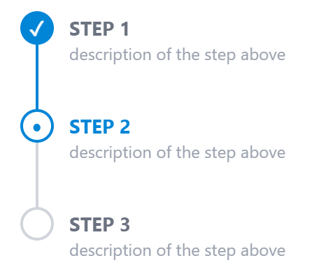
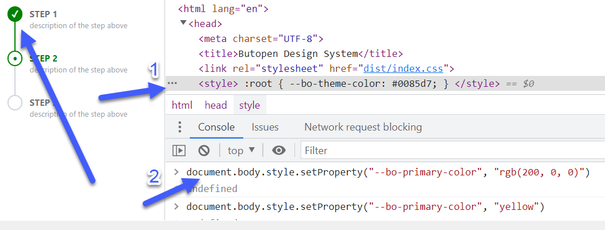

In this [frontend pill](https://thefrontendteam.com/pills/) we are going to create a 
stepper atomic component in pure css. 

We needed it in our design system to complete the onboard wizard at ssonext.com (WIP).

This would be the result:



Before writing the code (that is few lines, really) let's imagine the best way for the 
developer to consume this component.

## What is the best way to consume a stepper atomic component in pure css

Since the componet is in pure CSS, the developer expects to have some classes 
to create the component.

There are two conditions that we must respect to maximize the developer experience:
1) Minimize the number of tags necessary to create the stepper;
2) Use only CSS: no javscript at all

When making a stepper, the only thing that will be present is the stepper title:

```html
<div>Step 1: do something</div>
<div>Step 2: almost done</div>
<div>Step 3: done!</div>
```

Then we have to decide how to indicate the _state_ of the step: "**_to do_**"? "_**active**_"? "_**done**_"?

Each state could be a class:

```html
<div class="todo">Step 1: do something</div>
<div class="active">Step 2: almost done</div>
<div class="done">Step 3: done!</div>
```

The problem with the code above is that _**active**_ is a very common CSS class, so it is better 
to be more specific and use classes with detailed names. 

So we end up with the following classes:

```html
    <div class='bo-step-done'>
        STEP 1
    </div>
    <div class='bo-step-active'>
        STEP 2
    </div>
    <div class='bo-step-todo'>
        STEP 3
    </div>
```

Simple and compact. Now it's time to translate the code above to this css atomic component:


## How to implement a stepper component in SCSS + TailwindCSS
To implement our stepper atomic component, remember that we want to use **pure css**: so **no javascript** at all.

The developer should also be able to implement the stepper using only **one html tag** (Developer experience: keep the number of tags to a minimum possible).

### Drawing the step circle

To draw the circle, we use the following tailwind classes:

```css
@apply h-6 w-6 rounded-full border-2 border-bop bg-bop ;
```

`rounded-full` combined with `bg-bop` will make a circle shape using the main color (the `-bop` color... see the note below).

Why a `border-2`? Because we will customize it later for the specific state.

<div class="note" >
<b>Note</b> <br>
The `-bop` color in `bg-bop` and `border-bop` refers to the primary butopen color. You can use 
`-red-600` or `-green-500`... it's your choice. 
<br>
The good thing of the ButOpen primary color is that 
it is a CSS 3 variable so the color can be customized at runtime using a root style (1) or using javascript (2)

</div>


The empty circle will extend the filled circle, but using the `@apply bg-white` class. 

We will see how in a moment.

#### Circle position
The circle will be positioned at the center of the step height, so we'll add these tailwind classes:

```css
flex items-center justify-center absolute top-0
```

#### Circle icons
Since we want to have pure css, we had three choices for the icons:
- base64 image data url in css (e.g. using this online tool: [https://www.cssportal.com/image-to-data/](https://www.cssportal.com/image-to-data/))
- SVG data url in css (e.g. using this online tool: [https://yoksel.github.io/url-encoder/](https://yoksel.github.io/url-encoder/))
- UTF8 icons (e.g. here: [https://www.utf8icons.com/](https://www.utf8icons.com/))

We are lucky enough to have these icons available in UTF-8:

The check icon in pure CSS: **✓**

The bullet icon in pure CSS: **•**

### Drawing the step vertical line
The vertical line will be an empty element with a border. 

We can use the following tailwind classes:

```css
@apply block h-full w-0.5 border border-gray-300 absolute top-0 -left-4
```

The `block h-full w-0.5 border border-gray-300` classes will draw the vertical line.

The last three classes are used to position the element relative to the parent.

### Let the developer use a single `div` tag to implement the step
We want the developer to implement the stepper using:
- a _single tag_ 
- and a _single class_

So we use the _after_ and _before_ CSS pseudo classes.

The CSS (SCSS syntax) of the base step is as follows:

```scss
._bo-step {
  // the text
  @apply relative ml-8 pb-8 pt-0.5 pl-2 text-sm font-bold text-gray-500;
  
  // the vertical line
  &:before {
    content: "";
    @apply absolute top-0 -left-4 block h-full w-0.5 border border-gray-300;
  }
  
  // the icon
  &:after {
    content: "";
    @apply absolute top-0 flex h-6 w-6 items-center justify-center rounded-full border-2 border-bop bg-bop;
    left: -1.7rem;
  }
}

```

This will be our base CSS structure for the _step_ pure CSS atomic component. 

Note that I added a small underscore for the name of the class (`_bo-step`) since **I do not want the developer to use this class directly**. 
It's like a _"private" class_.

Having this base structure, we can easily define each _step status_ by customizing some parts:

Look at the result:


The **DONE** step will have:
- a vertical line using the main color
- a check icon (white color)
- a filled circle (main color)

```scss

.bo-step-done {
  @extend ._bo-step;
  &:before {
    @apply border-bop;
  }
  &:after {
    content: "✓";
    @apply text-sm font-black text-white;
  }
}
```

With `@extend` we extend the base CSS structure. 

Then we override the border color (from gray to primary) by specifying the new tailwind classes in the `&:before` section.

The same in the `&:after` section: 
- `content: "✓"` for check icon
- some tailwind font rules to make the check icon white (remember it is a UTF8 text). 


<br>
<br>

The **ACTIVE** and **TODO** steps are similar.

The **ACTIVE** step will have:
- a vertical line using the main color
- a bullet icon (main color)
- a white circle with a main color border
```scss
.bo-step-active {
  @extend ._bo-step;
  @apply text-bop;
  &:after {
    content: "•";
    @apply bg-white pb-1 text-lg font-black text-bop;
  }
}
```

The **TODO** step will have:
- a gray vertical line
- no icon
- a white background and a gray border for the circle

```scss
.bo-step-todo {
  @extend ._bo-step;
  &:after {
    @apply rounded-full border-gray-300 bg-white;
  }
  &:last-child {
    &:before {
      @apply border-transparent;
    }
  }
}
```

## The Complete ButOpen Design System

This component is now part of the _ButOpen Design System_:
- it's **open source**
- it's made in **pure css** (SCSS+TailwindCSS)  
- it's easy to consume and integrate into any frontend framework

You can find it here: [https://github.com/butopen/butopen-design-system](https://github.com/butopen/butopen-design-system)
